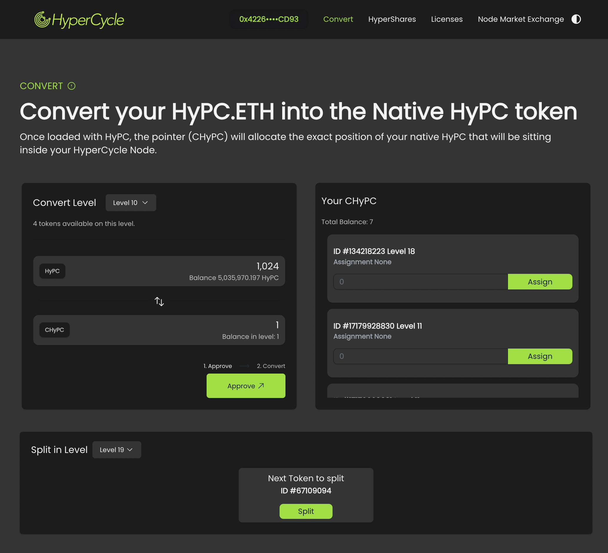

To use this page, your wallet must be connected. This page is divided in three sections:

#### **Convert Level**

- Allows you to convert your HYPC into CHYPC, with the price depending on the level of the CHYPC token you wish to purchase.
- Each level costs twice as much as the previous one, starting from level 10 (cost: 1,024) up to level 19.
- Below the Convert Level text, you can see the number of tokens available at each level. Tokens cannot be converted instantaneously; the contract must have token availability at that level.
- If tokens are unavailable at your desired level, use the "Split in Level" section.

#### **Your CHYPC**

- Displays a list of the CHYPC tokens you hold in your wallet.
- Note: The assignments functionality has been deprecated and will be removed soon.

#### **Split in Level**

- Allows users to create conditions to trade for a token at a specific level.
- If you need a level 15 token but none are available, check for availability at a higher level.
- Once you find a token that can be split into tokens of the desired level, click the split button. This will open a modal where you can choose the level to split the current token into.
