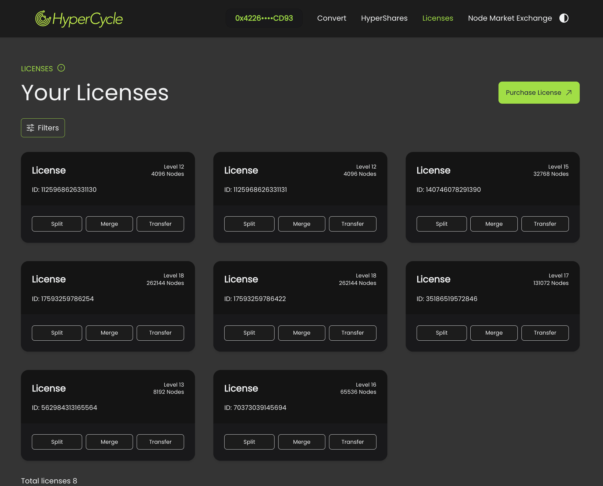

The Licenses section provides the following functionalities:

- **View Licenses**: Allows you to see your Hypercycle licenses.
- **Split Licenses**: Enables you to split a license into two licenses of the immediate lower level (e.g., one level 18 license can be split into two level 17 licenses).
- **Join Licenses**: Allows you to combine two licenses of the same level into one license of the next higher level.

**Note**: Licenses cannot exceed level 19 or drop below level 10 under any circumstances.
