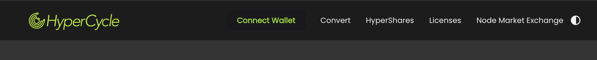

- **Hypercycle Logo**: Located on the left, this logo navigates you back to the start screen.
- **Connect Wallet**: This button allows you to connect your preferred wallet to the app. Connecting your wallet is essential for performing any actions within the app.
- **Convert**: This link directs you to the Convert page, where you can transform your Hypercycle tokens into CHyPC, an NFT representing a specific amount of Hypercycle tokens.
- **Hypershire**: This link takes you to your Hyper Shares, which are data structures that integrate licenses and CHyPC NFTs. These structures are crucial for the tilling process as they are the officially supported method for utilizing a license.
- **Licenses**: This link leads to the Licenses page, where you can view, transfer, and split your licenses into two lower-rank licenses.
- **Node Market**: This link directs you to Nordemarket.io, a site where you can purchase crypto assets, particularly licenses and HYPC tokens.
